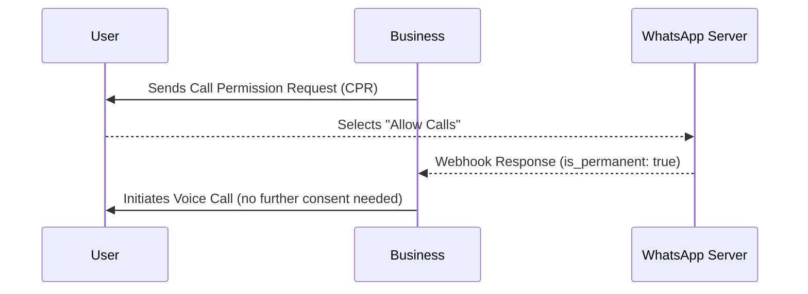

## 1. Overview

Permanent call permission allows a business to make voice calls to WhatsApp users **without requesting temporary permission each time**.  
Earlier, businesses could only place calls after users granted temporary permission.  
With **permanent permissions**, users can choose to always allow calls from a business.

This is especially useful for businesses with frequent or critical voice interactions — e.g. delivery agents, logistics, customer service, or support follow-ups.

***

## 2. Objective

The main goal of permanent permission is to:

* Improve user experience by reducing repetitive approval requests.
* Enable instant voice communication when users opt-in once.
* Ensure privacy and consent compliance — users still control call access.
* Streamline business workflows for operations like delivery tracking or support.

***

## 3. How It Works

1. **User Consent**  
   Businesses send a **Call Permission Request (CPR)** message through WhatsApp.  
   The user sees options such as:
   * **Allow calls** → grants permanent permission
   * **Temporarily allow** → grants permission for 7 days
   * **Not at this time** → rejects permission

2. **Permanent Permission Stored**  
   Once the user taps **Allow calls**, their choice is stored permanently, allowing calls anytime without asking again.

3. **Webhook Event Confirmation**  
   Meta sends a webhook event confirming the user’s response:
   * `is_permanent: true` → permanent access granted
   * `expiration_timestamp` → temporary permission

4. **Call Handling**  
   Businesses can then make voice calls using the WhatsApp Cloud API.

<Image align="center" border={true} src="https://files.readme.io/e742c89405e19edf4c18e3fb33386bb04db2d00ebac89dedf1a750dbe33ed31b-image.png" className="border" />

<br />

***

## 4. Permission States

| State           | Description                                                  |
| --------------- | ------------------------------------------------------------ |
| `no_permission` | User hasn’t set any call preference yet                      |
| `temporary`     | User has granted temporary permission (expires after 7 days) |
| `permanent`     | User has permanently allowed calls from the business         |

***

## 5. Partner API Reference

The same API is used for both **temporary** and **permanent** permissions — only the webhook response differs.

### 📘 Partner API — Send Call Permission Request

```bash
POST https://partner.gupshup.io/partner/app/{appId}/v3/message
```

### Headers

```
Authorization: {{PARTNER_APP_TOKEN}}
Content-Type: application/json
```

### Body Example

```Text Json
{
  "messaging_product": "whatsapp",
  "recipient_type": "individual",
  "to": "91XXXXXXXXXX",
  "type": "interactive",
  "interactive": {
    "type": "call_permission_request",
    "action": { "name": "call_permission_request" },
    "body": { "text": "We would like to call you to support your query." }
  }
}
```

### Webhook Response — Permanent Permission

```
"interactive": {
  "call_permission_reply": {
    "is_permanent": true,
    "response": "accept",
    "response_source": "user_action"
  },
  "type": "call_permission_reply"
}
```

### Webhook Response — Temporary Permission

```
"call_permission_reply": {
  "expiration_timestamp": 1759836840,
  "response": "accept"
}
```

***

### Visual Flow Diagram



***

## 6. Limitations

* User must still approve once via the permission request message.
* User can revoke permission anytime from WhatsApp settings.
* Temporary permission expires after 7 days.
* Maximum **5 connected calls** per user–business pair per 24 hours.
* Permissions are specific to the **WhatsApp Business number**.
* No API contract changes — same endpoints are used.

***

## 7. Benefits

* No repeated permission requests.
* Faster and more reliable voice communication.
* Better user experience and engagement.
* Reduced latency in business-to-user calls.

***

## 8. Summary

| **Aspect**            | **Details**                                           |
| --------------------- | ----------------------------------------------------- |
| **Feature Name**      | Permanent Call Permission                             |
| **Introduced By**     | Meta (WhatsApp Cloud API)                             |
| **Purpose**           | Allow users to give long-term consent for voice calls |
| **Permission Types**  | Permanent, Temporary (7 days), No Permission          |
| **Setup**             | Requires user consent via CPR message                 |
| **Webhook Indicator** | `is_permanent: true`                                  |
| **API Change**        | None – uses existing endpoints                        |
| **Ideal For**         | Logistics, customer service, frequent call scenarios  |

***

## 9. Key Notes

* This feature aligns with **<Anchor label="Meta’s WhatsApp Cloud API documentation" target="_blank" href="https://developers.facebook.com/docs/whatsapp/cloud-api/calling/user-call-permissions">Meta’s WhatsApp Cloud API documentation</Anchor>** on user call permissions.
* It enhances the business-to-user calling workflow by introducing a **one-time, permanent opt-in mechanism**.

***

<br />